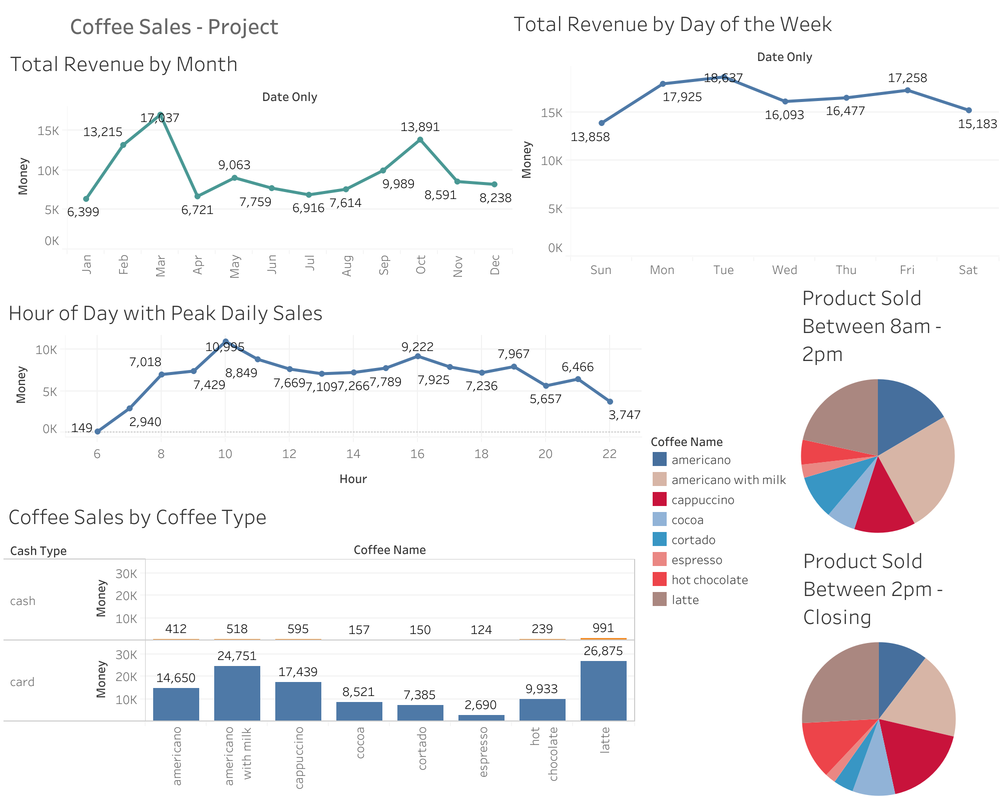

##Step 1. Kick-off meeting with management

The coffee shop owner wants to understand key sales patterns to make informed decisions. They are asking which coffee types are the best sellers overall, how customers are paying—whether mostly by cash or card—what days of the week bring in the most revenue, and which times of day tend to be the busiest in terms of sales. This information will help them identify customer preferences, adjust inventory and staffing levels, and create targeted promotions to boost overall sales performance.use. 

---

## Step 2. Documenting a task during a meeting

**Goal**:
- Which coffee products are selling the most,
- How customers are paying,
- What days drive the most revenue,
- What time periods are the busiest in terms of sales.

---

## Tools Used

- Python
- Pandas
- Excel

---

## What This Project Does

1. Loads raw `.csv` coffee sales data into a Pandas DataFrame
2. Cleans the data by:
   - Removing missing values
   - Dropping duplicates
   - Cleaning column names (stripping spaces, making lowercase)
4. Exports the cleaned data to an Excel file

---
[Link Tableau](https://public.tableau.com/views/CoffeeSales_17491921371660/Dashboard1?:language=en-US&:sid=&:redirect=auth&:display_count=n&:origin=viz_share_link)

---

**Assessment**: Latte is the top-performing product overall, followed closely by Americano with milk. Espresso is the least sold item, with a sales difference of 27,866 vs. 2,814, representing a 90% decrease compared to lattes.

While lattes dominate in total sales, sales between 8 AM and 2 PM show Americanos with milk as the most frequently purchased item during that period. After 2 PM until closing, lattes resume as the leading product. Espresso consistently remains the lowest-selling item across both time ranges.

The majority of transactions are completed via credit card, indicating a preference for card payments among customers.

In terms of hourly sales trends, 10 AM shows the highest sales volume, with a dip midday and a slight increase again around 4 PM.

Looking at total revenue by day of the week, Tuesdays generate the highest average sales, followed by Monday and Friday, which are nearly equal. Sunday consistently yields the lowest revenue.

Looking at monthly trends, March stands out as the highest-grossing month with $17,037, while January has the lowest at $6,399, reflecting a 166.2% increase in sales. Revenue fluctuates throughout the year, with another strong performance in October, and moderate dips during the summer months. This seasonal variation may suggest opportunities for promotions or targeted marketing during slower periods.

**Quick Summary Notes**:

- Top-Selling Product:

  - Latte is the highest-selling item overall.

  - Americano with milk ranks second.

- Lowest-Selling Product:

  - Espresso has the fewest sales (2,814), compared to lattes (27,866) — a 90% decrease.

- Time-Based Sales Trends:

  - 8 AM – 2 PM: Americano with milk is the top seller.

  - 2 PM – Close: Latte returns as the top performer.

  - Espresso remains the lowest seller in both time periods.

- Payment Method Insights:

  - The majority of sales are made via credit card.

- Hourly Sales Trends:

  - 10 AM sees the highest average daily sales.

  - Sales dip slightly midday and rise again around 4 PM.

- Daily Revenue Trends:

  - Tuesday generates the highest average revenue.

  - Monday and Friday follow closely behind.

  - Sunday has the lowest total revenue.

- Monthly Revenue
  - March: Highest revenue ($17,037).

  - January: Lowest revenue ($6,399).

  - 166.2% increase from January to March.

  - October is another strong month.

  - Summer months show fluctuating, mid-range sales.
